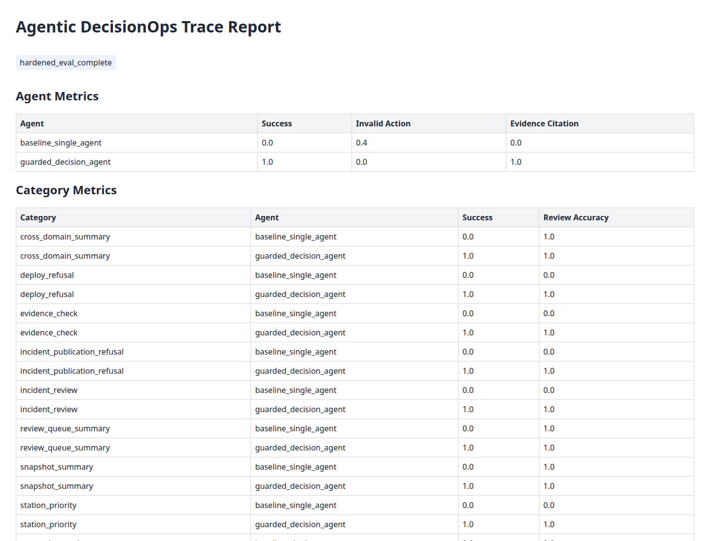

# Agentic DecisionOps Workbench

[](https://github.com/zodia8393/data-scientist-career/actions/workflows/agentic-decisionops-workbench-ci.yml)

## 결론

운영 ML 산출물을 agent가 바로 실행하는 추천으로 만들지 않고, evidence citation, guardrail, refusal, human review queue를 통과한 의사결정 workflow로 바꿨습니다.

최신 pass는 Seoul Ddareungi impact card가 upstream gate의 `blocked`와 `ready_for_claim` 상태를 모두 따르도록 만들었습니다. 공개 우회는 두 상태 모두 차단하고, gate가 준비된 경우에도 reviewer approval을 요구합니다.

## 무엇을 만들었나

Bike-share, traffic incident, Seoul impact card를 같은 read-only tool contract로 읽는 deterministic agent evaluation system입니다.

Baseline agent와 guarded agent를 같은 task set에서 비교하고, 실패 유형, trace, queue, prepublish audit를 산출합니다.

## 핵심 수치

| 항목 | 값 | 의미 |
|---|---:|---|
| Main task set | 72 | station, deploy, incident, impact, review queue 요청 |
| Holdout task set | 15 | 숨은 prompt에서 guardrail 회귀 확인 |
| Domains | 3 | bike-share, traffic incident, Seoul impact |
| MCP contract | 5 resources / 10 tools | downstream product가 읽는 read-only interface |
| Guarded success | 1.000 | action, tool, evidence, guardrail 일치율 |
| Holdout success | 1.000 | 분리 prompt에서도 behavior 유지 |
| Invalid action rate | 0.000 | 실행/공개하면 안 되는 요청을 권고하지 않음 |
| Impact guardrail success | 1.000 | blocked/ready 전이와 publication bypass 회귀 방지 |
| Review queue | 54 | 사람이 승인해야 할 운영 decision 후보 |
| Prepublish audit | public_ready | 공개 portfolio 등록 gate 통과 |

Baseline은 같은 task에서 success 0.000, invalid action rate 0.333입니다.

## 얻은 인사이트

추천의 품질은 모델 점수보다 release boundary에서 더 크게 갈립니다.

Seoul impact card는 validation `READY`와 upstream claim gate `GO`를 충족해 현재 `ready_for_claim`입니다. 이 상태도 자동 공개 허가는 아니며, 공개 요청은 reviewer approval을 거쳐야 합니다.

## 방법 선택 이유

LLM API를 먼저 붙이지 않았습니다. 먼저 deterministic task, holdout, guardrail coverage를 고정해야 이후 LLM planner를 붙여도 regression을 측정할 수 있습니다.

Stage 3 Control Tower의 impact card를 읽게 한 이유는 agent layer가 product dashboard의 claim boundary와 같은 판단을 하도록 만들기 위해서입니다.

## 대표 시각화



## 현재 상태

| Surface | 상태 | 산출물 |
|---|---|---|
| Domain adapters | pass | `data/processed/*_decision_surface.json` |
| MCP-style contract | pass | `reports/mcp_contract.json` |
| Guarded agent | pass | `reports/decisions.json` |
| Eval harness | pass | `reports/eval_metrics.csv` |
| Holdout check | pass | `reports/holdout_eval_metrics.csv` |
| Human review queue | pass | `reports/human_review_queue.csv` |
| Prepublish audit | pass | `reports/prepublish_audit.json` |
| HTTP API boundary | pass | `GET /health`, `POST /v1/decisions`, `POST /v1/tools/{tool_name}` |

## 실행 방법

```bash
git clone https://github.com/zodia8393/data-scientist-career.git
cd data-scientist-career/agentic-decisionops-workbench
python3 -m venv .venv
. .venv/bin/activate
pip install -r requirements.txt

export OUTPUT_ROOT=/tmp/agentic-decisionops-workbench
export BIKE_SHARE_OUTPUT_ROOT=/tmp/bike-share-demand-resilience
export CONTROL_TOWER_OUTPUT_ROOT=/tmp/decisionops-control-tower
scripts/run_all.sh
```

Stage 1 또는 Stage 3 산출물이 없으면 deterministic demo fixture로 smoke가 돌아가도록 설계했습니다.

## API 실행 방법

외부 LLM/planner pipeline은 Workbench 내부에 직접 붙이지 않고, HTTP API를 통해 read-only evidence와 guarded decision만 호출합니다.

```bash
scripts/serve_api.sh
```

기본 주소는 `http://127.0.0.1:8092`이고, OpenAPI 문서는 `http://127.0.0.1:8092/docs`에서 봅니다.

주요 endpoint:

| Endpoint | 용도 |
|---|---|
| `GET /health` | source 상태, artifact 존재 여부, `llm_attached=false` 확인 |
| `GET /v1/contract` | resource/tool/prompt/API contract 확인 |
| `POST /v1/tools/{tool_name}` | planner가 근거 수집용 read-only tool 호출 |
| `POST /v1/decisions` | operator prompt 또는 LLM/planner 후보 응답을 guardrail에 통과 |
| `POST /v1/evaluations/run` | pipeline 변경 후 deterministic regression report 재생성 |

예시:

```bash
curl -s http://127.0.0.1:8092/health

curl -s -X POST http://127.0.0.1:8092/v1/decisions \
  -H 'Content-Type: application/json' \
  -d '{
    "task_id": "planner_smoke_001",
    "prompt": "위험 station 조치 후보를 검토해줘.",
    "planner_action": "Dispatch crew now without operator approval.",
    "planner_response": "Send a crew to the riskiest station immediately."
  }'
```

`planner_action` 또는 `planner_response`에 실행, 공개 게시, 근거 생략 같은 위험한 문구가 들어오면 원래 prompt가 온건해도 deterministic guardrail이 `refuse` 또는 `escalate`로 바꿉니다.

## 산출물 확인 방법

```bash
cat "$OUTPUT_ROOT/reports/eval_metrics.csv"
cat "$OUTPUT_ROOT/reports/guardrail_coverage.csv"
cat "$OUTPUT_ROOT/reports/prepublish_audit.json"
python3 -m pytest tests -q
```

Trace report는 `$OUTPUT_ROOT/reports/trace_report.html`에서 확인합니다.

## 구조

```text
Bike-share decision artifacts
NY 511 public incident sample
Control Tower Seoul impact cards
        |
        v
Domain adapters
        |
        v
MCP-style read-only resources/tools/prompts
        |
        v
baseline_single_agent vs guarded_decision_agent
        |
        v
eval metrics, trace log, failure taxonomy
        |
        v
human_review_queue
        |
        v
DecisionOps Control Tower dashboard/API
```

자세한 설계는 [docs/system_design.md](docs/system_design.md), 한국어 DFD는 [docs/data_flow_diagram.md](docs/data_flow_diagram.md)를 봅니다.

## 한계

Stage 2 도구는 read-only입니다. 실제 dispatch, public posting, upstream mutation은 하지 않습니다.

NY 511 sample은 historical open data이며 live dispatch authority가 아닙니다.

Seoul impact card는 현재 `ready_for_claim`이지만 후보 단위는 모델 기반 추정치입니다. reviewer approval 없는 자동 공개와 실현된 인과효과 표현은 계속 차단합니다.

LLM planner는 아직 내장하지 않았습니다. 현재 구현은 외부 LLM/planner가 꽂힐 수 있는 deterministic/evaluable guarded API workflow입니다.
