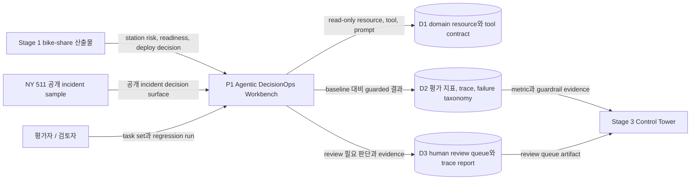
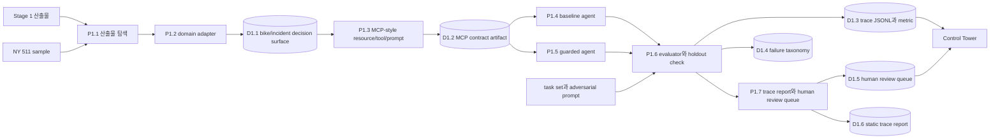

# 데이터 흐름도(DFD)

최종 업데이트: 2026-07-02 KST

## 범위

이 문서는 `agentic-decisionops-workbench`의 현재 데이터 흐름을 설명한다. 범위는 operations ML 산출물과 공개 incident sample을 read-only tool contract, guarded agent decision, evaluation trace, human review queue로 바꾸는 과정이다.

Stage 2는 의도적으로 CLI/reporting/evaluation surface다. 지속적인 approval workflow와 dashboard write는 Stage 3 `decisionops-control-tower`가 담당한다.

## 0단계 컨텍스트

## 1단계 논리 흐름

## 데이터 저장소

| 저장소 | 내용 | 생산자 | 소비자 |
|---|---|---|---|
| D1.1 bike/incident decision surface | 정규화된 station risk, readiness, incident summary, evidence pointer | domain adapter | tool contract builder |
| D1.2 MCP contract artifact | read-only decision support용 resource, tool, prompt contract | contract builder | baseline agent, guarded agent, Control Tower contract review |
| D1.3 trace JSONL과 metric | tool call, evidence, guardrail hit, decision, success metric | eval harness | trace report, quality gate, Control Tower |
| D1.4 failure taxonomy | invalid action, missing evidence, unsafe publication, source conflict 분류 | eval harness | 검토자, 포트폴리오 문서 |
| D1.5 human review queue | 사람이 승인 또는 반려해야 하는 decision | guarded agent와 evaluator | Stage 3 review queue projection |
| D1.6 static trace report | trace와 evaluation evidence를 보는 HTML review surface | report builder | 검토자, portfolio demo |

## 흐름 목록

| 흐름 | 출발 | 도착 | 데이터 | 검증 또는 gate |
|---|---|---|---|---|
| F1 | Stage 1 산출물 | domain adapter | station risk, readiness, deploy blocker | upstream `NO_GO` decision을 보존해야 함 |
| F2 | NY 511 sample | domain adapter | 공개 incident event | live dispatch/publication 권한 없음 |
| F3 | domain adapter | MCP-style contract | resource, tool, prompt | read-only contract만 허용 |
| F4 | tool contract | baseline agent | guardrail 없는 decision response | 비교 baseline으로 사용 |
| F5 | tool contract | guarded agent | evidence-aware decision response | unsafe action, weak evidence, high uncertainty 차단 |
| F6 | agent | evaluator | decision, action, citation, guardrail outcome | main/holdout task success metric |
| F7 | evaluator | trace/metric 저장소 | JSONL trace, eval metric, failure taxonomy | regression evidence와 portfolio audit |
| F8 | guarded agent/evaluator | human review queue | review-required decision item | Stage 3가 persistence와 approval workflow 담당 |

## 신뢰/안전 경계

| 경계 | 규칙 |
|---|---|
| read-only tool 경계 | Stage 2 도구는 decision support resource만 노출하며 upstream system에 write하지 않는다. |
| evidence 경계 | 최종 추천은 data/tool output을 인용해야 하며, 근거 없는 요청은 refusal 또는 escalation 처리한다. |
| guardrail 경계 | `NO_GO`, high uncertainty, unsafe write action, publication restriction, source conflict는 자동화를 차단한다. |
| review 경계 | human review queue는 output artifact이며 approval database가 아니다. Approval persistence는 Stage 3가 담당한다. |
| LLM 경계 | 현재 구현은 deterministic/evaluable 상태이며, regression gate 안정 후에만 LLM-backed planner를 추가한다. |

## 현재 운영 상태

- Main/holdout eval은 baseline과 guarded behavior를 비교하도록 설계되어 있다.
- Stage 2 단독 public deploy는 목표가 아니다.
- Stage 3가 Stage 2 review/eval artifact를 소비해 API, dashboard, SQLite persistence, monitoring을 제공한다.
