# DecisionOps AI Suite 데이터 흐름도(DFD)

최종 업데이트: 2026-07-02 KST

## 범위

이 문서는 `bike-share-demand-resilience`, `agentic-decisionops-workbench`, `decisionops-control-tower`를 하나의 DecisionOps AI Suite로 볼 때의 논리적 데이터 흐름도다. 확정된 방향은 미국 bike-share benchmark에서 시작해 서울 따릉이 공개데이터 adapter와 decision impact simulator로 확장하는 구조다.

목적은 포트폴리오 검토자가 "데이터가 어디서 들어와서, 어떤 판단 산출물로 바뀌고, 어디에서 사람이 승인하며, 무엇이 배포를 막는가"를 한 번에 확인할 수 있게 하는 것이다.

## 0단계 컨텍스트

```mermaid
flowchart LR
    E1["외부 데이터 제공자<br/>UCI, Citi Bike, GBFS, Open-Meteo, NY 511"]
    E4["서울 따릉이 공개데이터<br/>실시간 대여정보, 대여이력"]
    E2["검토자 / 운영자"]
    E3["채용 검토자 / 데모 사용자"]

    P1["P1 Stage 1<br/>공공자전거 운영 ML"]
    P4["P4 서울 따릉이 adapter와<br/>impact simulator"]
    P2["P2 Stage 2<br/>Agentic DecisionOps Workbench"]
    P3["P3 Stage 3<br/>DecisionOps Control Tower"]

    D1[("D1 Bike 산출물<br/>예측, station snapshot, readiness")]
    D4[("D4 Impact 산출물<br/>baseline 비교, 추천 action, 기대 개선")]
    D2[("D2 Agentic 산출물<br/>도구 계약, trace, 평가, review queue")]
    D3[("D3 Control Tower 산출물<br/>control state, SQLite 승인, dashboard")]

    E1 -->|"공개 데이터와 실시간 상태 snapshot"| P1
    E4 -->|"대여소 상태와 대여/반납 이력"| P4
    P1 -->|"검증된 예측, 불확실성, 재배치, readiness"| D1
    D1 -->|"risk, uncertainty, readiness"| P4
    P4 -->|"baseline 대비 기대 개선과 추천 action"| D4
    D1 -->|"판단 근거 데이터"| P2
    D4 -->|"impact evidence"| P2
    E1 -->|"NY 511 공개 사고 sample"| P2
    P2 -->|"guardrail 적용 판단, trace, 평가 지표, review queue"| D2
    D1 -->|"upstream readiness와 station risk"| P3
    D4 -->|"impact card 입력"| P3
    D2 -->|"agent 검토/평가 산출물"| P3
    E2 -->|"검토 판단과 승인 action"| P3
    P3 -->|"local 승인 기록과 product 산출물"| D3
    P3 -->|"API, dashboard, 배포 판단"| E3
```

## 1단계 논리 흐름

```mermaid
flowchart LR
    subgraph S1["Stage 1: 운영 ML 엔진"]
        P11["P1.1 데이터 수집"]
        P12["P1.2 feature/label pipeline"]
        P13["P1.3 예측, 불확실성, audit"]
        P14["P1.4 재배치와 readiness gate"]
        P15["P1.5 서울 adapter와 impact simulation"]
    end

    subgraph S2["Stage 2: Agentic decision layer"]
        P21["P2.1 domain adapter"]
        P22["P2.2 read-only tool contract"]
        P23["P2.3 baseline/guarded agent"]
        P24["P2.4 평가, trace, human review queue"]
        P25["P2.5 impact-aware guardrail"]
    end

    subgraph S3["Stage 3: Product control surface"]
        P31["P3.1 산출물 수집"]
        P32["P3.2 control-state와 queue projection"]
        P33["P3.3 FastAPI와 dashboard"]
        P36["P3.4 impact card"]
        P34["P3.5 SQLite 승인 boundary"]
        P35["P3.6 monitoring과 deploy readiness"]
    end

    D11[("원천/공개 데이터")]
    D12[("Stage 1 report와 station snapshot")]
    D13[("impact report와 action recommendation")]
    D21[("Stage 2 trace, metric, review queue")]
    D31[("Stage 3 report, log, SQLite, dashboard")]

    D11 --> P11 --> P12 --> P13 --> P14 --> D12
    D12 --> P15 --> D13
    D12 --> P21
    D13 --> P21
    P21 --> P22 --> P23 --> P24 --> P25 --> D21
    D12 --> P31
    D13 --> P31
    D21 --> P31
    P31 --> P32 --> P33 --> P36
    P33 -->|"권한 확인 후 approval POST"| P34 --> D31
    P32 --> P35 --> D31
```

## 데이터 저장소

| 저장소 | 소유 단계 | 내용 | 보존 위치 | Git 정책 |
|---|---|---|---|---|
| D1 Bike 산출물 | Stage 1 | 예측 report, model/eval 요약, station snapshot, prospective readiness, deploy gate | 데이터 산출물 root 아래 `OUTPUT_ROOT` | 대용량/생성 산출물 제외 |
| D4 Impact 산출물 | Stage 1 | baseline policy 비교, expected shortage/overflow reduction, false alarm cost, action recommendation | 데이터 산출물 root 아래 `OUTPUT_ROOT` | 충분한 validation 전 public 성과 claim 금지 |
| D2 Agentic 산출물 | Stage 2 | MCP-style 계약, 평가 지표, trace JSONL/report, failure taxonomy, human review queue | workbench 산출물 root 아래 `OUTPUT_ROOT` | `scripts/run_all.sh`로 재생성 |
| D3 Control Tower 산출물 | Stage 3 | `control_state.json`, review queue CSV, OpenAPI contract, dashboard, ops metrics, deployment readiness, SQLite 승인 | control tower 산출물 root 아래 `OUTPUT_ROOT` | source/docs만 Git 관리, runtime 상태 제외 |

## 흐름 목록

| 흐름 | 출발 | 도착 | 데이터 | 통제 기준 |
|---|---|---|---|---|
| F1 | 외부 데이터 제공자 | Stage 1 | 공개 수요, station, weather, live status 데이터 | 원천 데이터는 Git 밖에 보존 |
| F2 | Stage 1 | D1 | 예측, 불확실성, segment audit, station shortage label, readiness | time-aware validation과 public deploy gate |
| F3 | D1/D4 | Stage 2 | 공개 가능한 판단 근거와 impact evidence | agent는 근거를 인용하고 `NO_GO`, low-impact, weak-evidence를 따라야 함 |
| F4 | NY 511 공개 sample | Stage 2 | 공개 사고 decision surface | live dispatch 권한 없음 |
| F5 | Stage 2 | D2 | guardrail 적용 판단, trace, metric, review queue | 위험 action과 약한 근거는 review/refusal로 전환 |
| F6 | D1/D2 | Stage 3 | upstream readiness, station risk, review queue | control state가 blocker를 숨기지 않고 노출 |
| F6a | D4 | Stage 3 | 추천 action, 기대 개선, confidence, false alarm cost | impact card가 과장된 성과 claim을 막음 |
| F7 | 검토자/운영자 | Stage 3 | 승인 또는 반려 action | role token 설정 시 RBAC-lite write auth 적용 |
| F8 | Stage 3 | D3 | 승인 history, monitoring, 배포 판단 | write는 SQLite와 report artifact에 한정 |
| F9 | Stage 3 | 데모 사용자 | dashboard, OpenAPI, readiness view | upstream readiness 충족 전 public deploy는 `NO_GO` |

## 신뢰/안전 경계

| 경계 | 규칙 |
|---|---|
| 원천 데이터 경계 | 원천 데이터와 대용량 생성 산출물은 Git 밖에 두고 문서화된 명령으로 재생성한다. |
| Agent action 경계 | Stage 2 도구는 read-only이며, 추천에는 evidence와 guardrail 결과가 포함되어야 한다. |
| Human review 경계 | 높은 불확실성, unsafe write, publication risk, source conflict는 review queue를 거친다. |
| Product write 경계 | Stage 3 승인은 `control_tower.sqlite`에만 기록하며 Stage 1/2 산출물이나 현장 action을 변경하지 않는다. |
| Public deploy 경계 | Upstream claim readiness와 endpoint deployment readiness를 분리한다. Stage 1/2가 준비돼도 Stage 3 write auth가 없으면 public endpoint는 차단된다. |

## 현재 배포 해석

이 suite는 local 실행과 포트폴리오 검토가 가능하고 upstream evidence/claim gate도 준비된 상태다. 다만 public endpoint deployment는 인증 hardening 전까지 의도적으로 차단한다.

- Stage 1은 cutoff가 고정된 340개 snapshot, 14.01일 cohort로 prospective validation을 통과했다.
- Stage 2는 평가 가능 상태지만 production mode의 LLM-backed planner는 아직 붙이지 않았다.
- Stage 3는 API, dashboard, approval persistence, monitoring, deployment readiness를 가진 local/container product slice이며, hosted/public endpoint는 write auth 미설정으로 `NO_GO`다.
